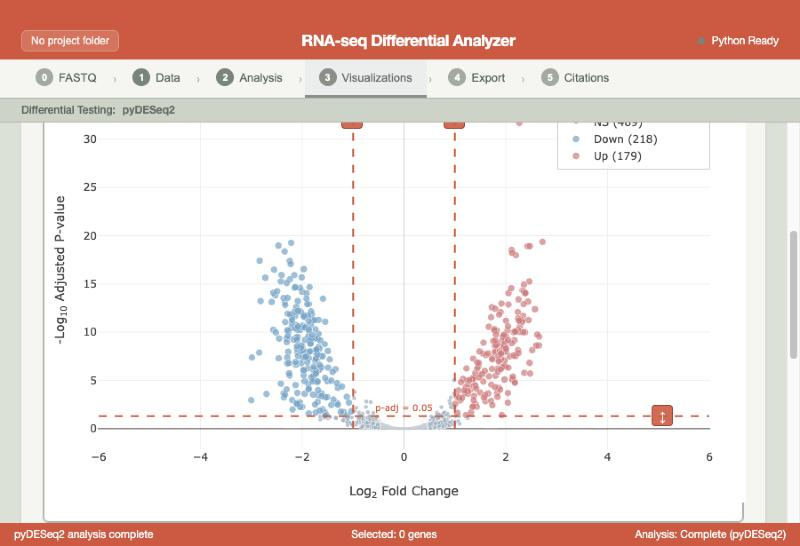

# RNAnalysis



## !! This tool is in development !!

This means that publishing anything created using this tool is inadvisable at this time.
I will try my best to validate every function to the best of my ability if I have time.
When that happens this tool will undergo a major release version and i will write out the assumptions that were made to check everything.


Until that time happens feel free to use and provide feedback.
Some effort was made by me to ensure that the total number of downloaded files was kept small and to a safer minimized number of sites.
Currently we download data from the Pachter lab for kallisto as indexes as well as the whole kallisto package. 
Python packages are downloaded from pip and assumed safe.
Javascript packages are relatively few, pretty much just Tabulator, Plotly, Electron and electron builder.

That being said I currently can't make any guarantees about weird behavior so if you do find this useful and there is a major bug, let me know and open an issue.


## Citation

All that being said if you use RNAnalysis in your research (especially after I have verified things) and find it is helpful or useful.

Please consider giving me a citation (or a star :) )!

```bibtex
@software{callahan2026rnanalysis,
  author = {Callahan, Rowan},
  title = {RNAnalysis: RNA-seq Differential Expression Analysis Tool},
  year = {2026},
  url = {https://github.com/rowancallahan/RNAnalysis},
  license = {GPL-3.0}
}


